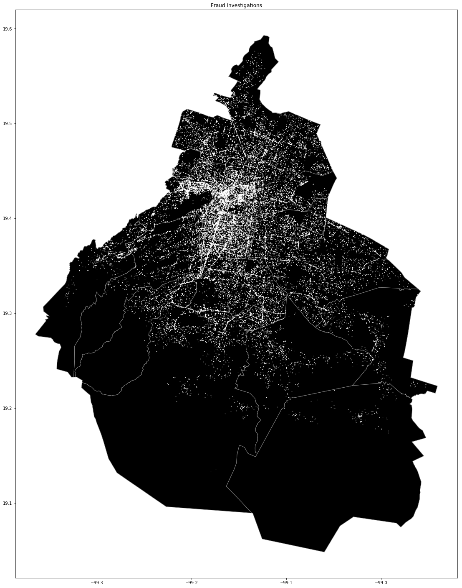
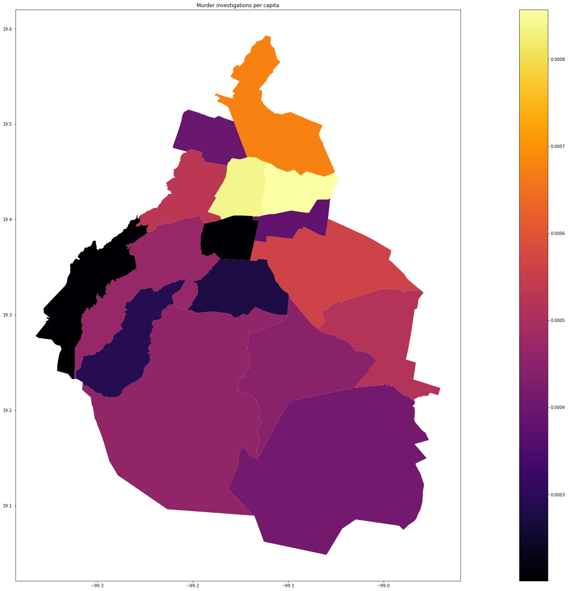

# Crime-maps
Creates some maps using the data of crime investigatinos in Mexico City.
The plots are made using bokeh and matplotlib (the file may not open in because of the use of bokeh).
This project was done using Google colab.

#Data obtained from

Crimes (could not upload full file because of size): https://datos.cdmx.gob.mx/explore/dataset/carpetas-de-investigacion-pgj-de-la-ciudad-de-mexico/information/?disjunctive.delito&dataChart=eyJxdWVyaWVzIjpbeyJjb25maWciOnsiZGF0YXNldCI6ImNhcnBldGFzLWRlLWludmVzdGlnYWNpb24tcGdqLWRlLWxhLWNpdWRhZC1kZS1tZXhpY28iLCJvcHRpb25zIjp7ImRpc2p1bmN0aXZlLmRlbGl0byI6dHJ1ZX19LCJjaGFydHMiOlt7ImFsaWduTW9udGgiOnRydWUsInR5cGUiOiJjb2x1bW4iLCJmdW5jIjoiQ09VTlQiLCJzY2llbnRpZmljRGlzcGxheSI6dHJ1ZSwiY29sb3IiOiIjNjZjMmE1In1dLCJ4QXhpcyI6ImFvX2hlY2hvcyIsIm1heHBvaW50cyI6NTAsInNvcnQiOiIifV0sInRpbWVzY2FsZSI6IiIsImRpc3BsYXlMZWdlbmQiOnRydWUsImFsaWduTW9udGgiOnRydWV9&disjunctive.ao_hechos
Geografic information: https://datos.cdmx.gob.mx/explore/dataset/alcaldias/map/

## Some generated maps

